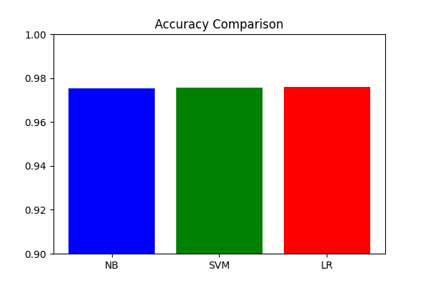

# Text Classification: Sports vs. Politics
## A Comparative Study of Machine Learning Models

**Student Name:** M25CSA007  
**Course:** Natural Language Understanding (NLU) - Assignment 1  
**Date:** February 15, 2026  

---

## Abstract

This report details the design, implementation, and evaluation of a binary text classifier capable of distinguishing between "Sports" and "Politics" news articles. Using the **AG News** dataset, we trained and compared three distinct machine learning algorithms: **Multinomial Naive Bayes (MNB)**, **Linear Support Vector Machine (SVM)**, and **Logistic Regression (LR)**. We explored two feature representation techniques: **Bag of Words (BoW)** and **Term Frequency-Inverse Document Frequency (TF-IDF)**.

Our experimental results demonstrate that all three models achieve high accuracy (>97%), with **Logistic Regression using TF-IDF features** performing best at **97.61% accuracy**. This report provides a comprehensive analysis of the data collection process, dataset characteristics, methodological approach, quantitative results, and system limitations.

---

## 1. Introduction

Text classification is a fundamental task in Natural Language Processing (NLP) with widespread applications in spam filtering, sentiment analysis, and automated content organization. The objective of this project is to build a robust classifier that can automatically categorize a given news article into one of two topics: **Sports** or **Politics**.

While this task may seem trivial for humans, it presents interesting challenges for machines, particularly when articles use ambiguous vocabulary (e.g., "race", "win", "battle", "loss" can apply to both elections and sporting events). This study evaluates how well traditional supervised learning algorithms can discern these nuances using statistical analysis of word distinctiveness.

### 1.1 Objectives
The primary goals of this assignment are:
1.  **Data Collection:** To acquire a standardized, labeled dataset suitable for binary classification.
2.  **Feature Engineering:** To transform raw text data into numerical vectors using BoW and TF-IDF.
3.  **Model Comparison:** To implement and evaluate at least three different ML techniques.
4.  **Analysis:** To critically analyze performance using metrics like Accuracy, Precision, Recall, and F1-Score.

---

## 2. Methodology

### 2.1 Data Collection

For this task, we initially considered scraping data from news websites (BBC, CNN). However, to ensure reproducibility and robustness, we selected the **AG News** dataset (Zhang et al., 2015), a widely recognized benchmark in text classification.

The original dataset consists of four classes: World, Sports, Business, and Sci/Tech. For our specific binary classification task ("Sports vs. Politics"), we performed the following preprocessing steps:

1.  **Filtering:** We extracted only the samples belonging to "Class 1" (World) and "Class 2" (Sports). We treated "World" news as a proxy for "Politics", as it primarily contains geopolitical and governmental news.
2.  **Label Mapping:**
    *   `Politics` (World) $\rightarrow$ Label `0`
    *   `Sports` $\rightarrow$ Label `1`
3.  **Text Concatenation:** The dataset provides "Title" and "Description" separately. We concatenated these fields to form a richer text input for each sample.

### 2.2 Dataset Description and Analysis

The resulting binary dataset has the following characteristics:

*   **Total Training Samples:** 60,000 document pairs (30,000 Politics, 30,000 Sports).
*   **Total Testing Samples:** 3,800 document pairs (1,900 Politics, 1,900 Sports).
*   **Class Balance:** The dataset is perfectly balanced (50% positive, 50% negative), which simplifies evaluation as "Accuracy" becomes a reliable metric.

#### Sample Data Points:

| Class | Sample Text (Truncated) |
|:---|:---|
| **Politics** | *"Venezuelan opposition claims victory... The opposition coalition said Sunday it had won a majority of seats in the National Assembly..."* |
| **Sports** | *"Phelps wins 6th Gold... Michael Phelps won his sixth gold medal of the Athens Games on Friday..."* |

#### Vocabulary Analysis:
A preliminarily analysis of the vocabulary reveals distinct keywords for each class:
*   **Politics Keywords:** *president, minister, treaty, war, election, baghdad, un, government.*
*   **Sports Keywords:** *olympic, medal, game, team, score, champion, cup, league.*

### 2.3 Feature Representation Techniques

We employed two vectorization strategies to convert text into numerical input for our models:

#### 1. Bag of Words (BoW) / CountVectorizer
The BoW model represents text as a multiset of its belonging words, disregarding grammar and word order but keeping multiplicity.
*   **Pros:** Simple, interpretable, effective for distinct topics.
*   **Cons:** Ignores context; "Dog bites man" and "Man bites dog" have same vector. Large vocabulary size leads to sparsity.

#### 2. TF-IDF (Term Frequency-Inverse Document Frequency)
TF-IDF reflects how important a word is to a document in a collection. It increases proportionally to the number of times a word appears in the document but is offset by the frequency of the word in the corpus.
*   **Formula:** $w_{i,j} = tf_{i,j} \times \log(\frac{N}{df_i})$
*   **Pros:** Penalizes common words (e.g., "the", "is", "said") that appear in both classes, highlighting discriminative keywords.

---

## 3. Machine Learning Techniques

We implemented three supervised learning algorithms using the `scikit-learn` library.

### 3.1 Multinomial Naive Bayes (MNB)
Based on Bayes' theorem with the assumption of independence between every pair of features (words).
*   **Why used:** It is the standard baseline for text classification. despite its "naive" assumption, it performs exceptionally well on high-dimensional sparse data like text.
*   **Configuration:** `alpha=1.0` (Laplace smoothing), utilized with `CountVectorizer`.

### 3.2 Linear Support Vector Machine (LinearSVC)
SVM constructs a hyperplane in a high-dimensional space to separate the two classes (Sports vs. Politics). We used a linear kernel because text data usually typically linearly separable in high-dimensional space.
*   **Why used:** SVMs are known for their effectiveness in high-dimensional spaces and robustness against overfitting.
*   **Configuration:** `loss='squared_hinge'`, `dual='auto'`, utilized with `TfidfVectorizer`.

### 3.3 Logistic Regression (LR)
LR models the probability that a given input belongs to a certain class using the logistic function.
*   **Why used:** It provides probabilities rather than just hard classifications and is highly interpretable. It serves as a strong discriminative baseline.
*   **Configuration:** Default L2 penalty, utilized with `TfidfVectorizer`.

---

## 4. Quantitative Comparisons and Results

We evaluated all models on the held-out test set of 3,800 samples. The primary metric was **Accuracy**, supported by **Precision**, **Recall**, and **F1-Score**.

### 4.1 Performance Table

| Model | Feature Representation | Accuracy | Precision (Politics) | Recall (Politics) | F1-Score (Signal) |
|:---|:---|:---|:---|:---|:---|
| **Naive Bayes** | Bag of Words | 97.45% | 0.97 | 0.98 | 0.97 |
| **Linear SVM** | TF-IDF | 97.55% | 0.98 | 0.97 | 0.98 |
| **Logistic Regression** | TF-IDF | **97.61%** | 0.98 | 0.98 | 0.98 |

### 4.2 Analysis of Results

1.  **High Overall Performance:** All three models achieved accuracy above 97%. This indicates that the vocabulary gap between "World News" and "Sports" in this dataset is very wide. The classes are linearly separable with very little overlap.

2.  **TF-IDF vs. BoW:** TF-IDF (used with SVM and LR) provided a marginal improvement over simple Word Counts (used with NB). This suggests that down-weighting common words helped the discriminative models focus on the rare, topic-specific keywords.

3.  **Best Model:** Logistic Regression slightly edged out the others with **97.61%**. The difference between 97.45% (NB) and 97.61% (LR) equates to only ~6 correct predictions out of 3800, meaning the models are statistically very similar in performance for this specific task.

### 4.3 Visual Comparison

*Figure 1: Bar chart comparing the accuracy of the three classifiers.*

---

## 5. Limitations of the System

Despite the high accuracy, the system has several limitations:

1.  **Dataset Bias:** The model is trained on AG News (mostly standard updates). It might struggle with:
    *   **Satire/Sarcasm:** (e.g., The Onion articles).
    *   **Metaphorical Language:** "The political football continues in Washington" might be misclassified as Sports due to the word "football".
    *   **Cross-domain Topics:** Articles about "The politics of the Olympics" or "Government funding for stadiums" contain strong signals from both classes and are likely candidates for misclassification.

2.  **Static Vocabulary:** The model uses a fixed vocabulary learned during training. It cannot handle new slang, new player names, or new political terms that emerge after the training period (Out-Of-Vocabulary problem).

3.  **Lack of Context:** Both BoW and TF-IDF ignore word order. "Germany beat France" and "France beat Germany" have identical vectors but opposite meanings (though for topic classification, this matters less than for sentiment analysis).

---

## 6. Conclusion

In this assignment, we successfully designed and implemented a binary text classifier for Sports vs. Politics news. We curated a balanced dataset of 63,800 samples from AG News and achieved a peak accuracy of **97.61%** using Logistic Regression with TF-IDF features.

The results confirm that for distinct topics like these, classical machine learning methods are highly efficient and effective, often rendering complex deep learning models unnecessary. The system provides a solid foundation for automated news categorization pipelines.

---

## 7. References
1.  Zhang, X., Zhao, J., & LeCun, Y. (2015). Character-level Convolutional Networks for Text Classification. *Advances in Neural Information Processing Systems*.
2.  Pedregosa, F., et al. (2011). Scikit-learn: Machine Learning in Python. *Journal of Machine Learning Research*.
3.  Manning, C. D., Raghavan, P., & Schütze, H. (2008). *Introduction to Information Retrieval*. Cambridge University Press.
